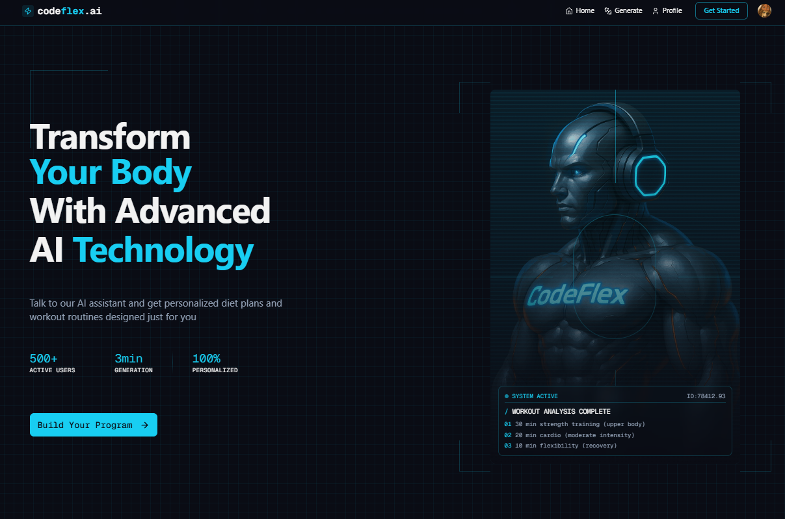
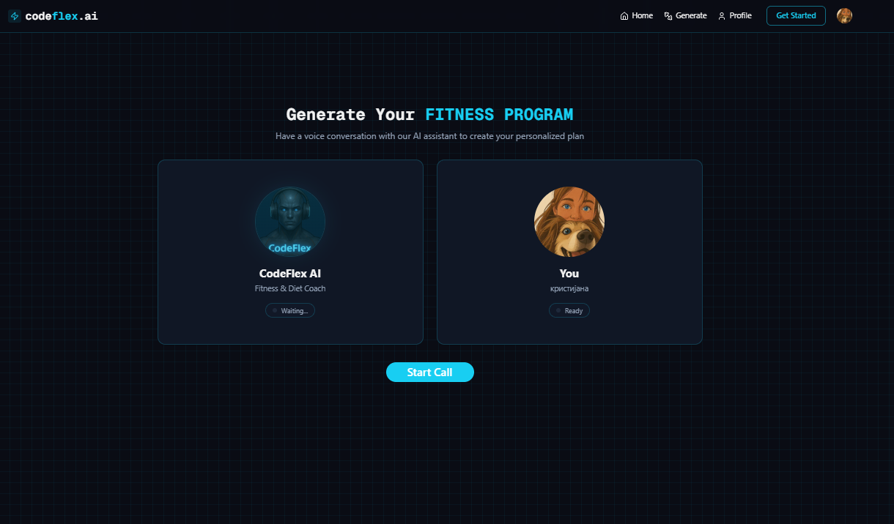

<h1 align="center">AI Fitness Assistant 🤖</h1>

## 🌐 Live App

The application is live and available here:  
👉 https://ai-fitness-trainer-oks7.onrender.com/






## Tech stack:

- 🚀 Next.js, React, Tailwind & Shadcn UI
- 🎙️ Voice AI Assistant (Vapi)
- 🧠 Gemini AI
- 🔒 Authentication & Authorization (Clerk)
- 💾 Database (Convex)

## Features

- **AI Assistant**: Engage in conversation with an AI that asks about your fitness goals, physical condition, and preferences
- **Personalized Workout Plans**: Get custom exercise routines based on your fitness level, injuries, and goals
- **Diet Recommendations**: Receive personalized meal plans accounting for your allergies and dietary preferences
- **User Authentication**: Sign in with GitHub, Google, or email/password
- **Program Management**: Create and view multiple fitness programs with only the latest one active
- **Responsive Design**: Beautiful UI that works across all devices

## Setup .env file

```js
# Clerk Authentication
NEXT_PUBLIC_CLERK_PUBLISHABLE_KEY=
CLERK_SECRET_KEY=

# Clerk Redirect URLs
NEXT_PUBLIC_CLERK_SIGN_IN_URL=/sign-in
NEXT_PUBLIC_CLERK_SIGN_UP_URL=/sign-up

# Vapi Voice AI
NEXT_PUBLIC_VAPI_WORKFLOW_ID=
NEXT_PUBLIC_VAPI_API_KEY=

# Convex Database
CONVEX_DEPLOYMENT=
NEXT_PUBLIC_CONVEX_URL=
```

## Getting Started

1. Clone the repository
2. Install dependencies:

```shell
npm install
```

3. Set up your environment variables as shown above
4. Run the development server:

```shell
npm run dev
```

5. Open [http://localhost:3000](http://localhost:3000) in your browser


## Learn More

To learn more about the technologies used in this project:

- [Next.js Documentation](https://nextjs.org/docs)
- [Clerk Documentation](https://clerk.com/docs)
- [Vapi Documentation](https://docs.vapi.ai)
- [Convex Documentation](https://docs.convex.dev)
- [Gemini AI Documentation](https://ai.google.dev/gemini-api)